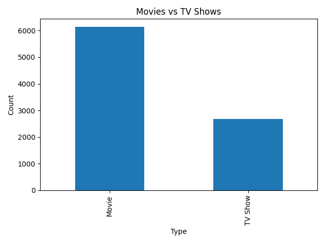
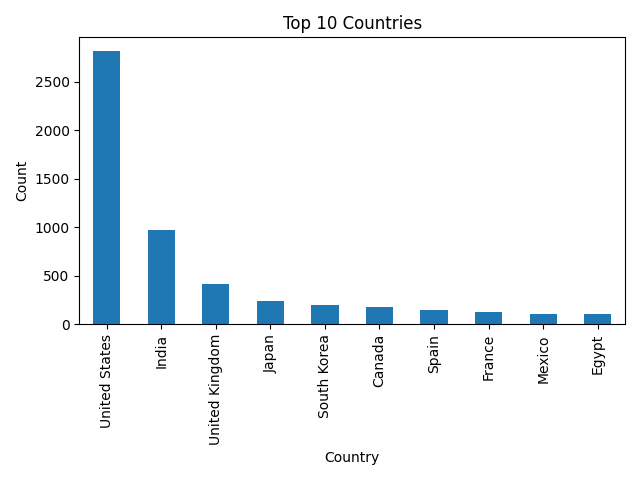
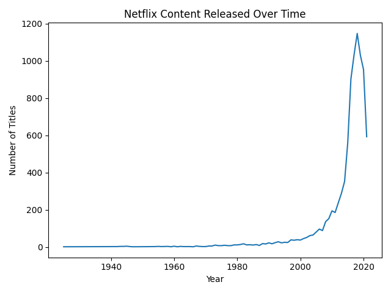
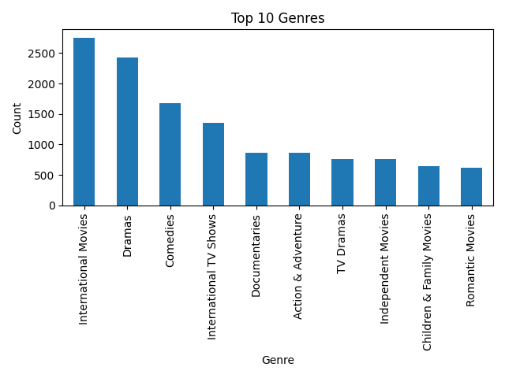
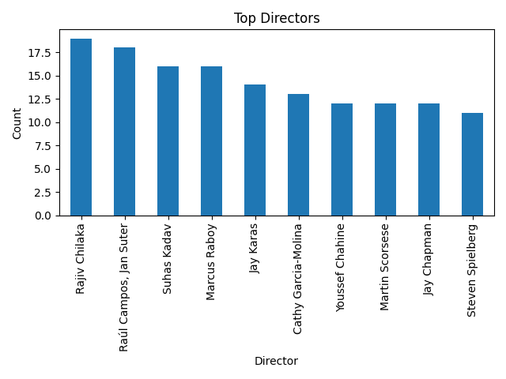

# Netflix Data Analysis

## Overview

This project analyzes the Netflix Movies and TV Shows dataset using Python, Pandas, and Matplotlib.

The objective is to explore Netflix content, uncover trends, generate visualizations, and practice real-world data analysis techniques.

## Technologies Used

* Python
* Pandas
* Matplotlib

## Project Structure

```text
netflix-data-analysis/
├── data/
│   └── netflix_titles.csv
│
├── images/
│   ├── movies_vs_tvshows_bar.png
│   ├── top_countries.png
│   ├── content_growth.png
│   ├── top_genres.png
│   └── top_directors.png
│
├── results/
│   └── insights.txt
│
├── src/
│   └── analysis.py
│
├── requirements.txt
└── README.md
```

## Analysis Questions

The project answers the following questions:

* How many Movies and TV Shows are available on Netflix?
* What percentage of Netflix content is Movies versus TV Shows?
* Which countries produce the most Netflix content?
* What are the most popular genres?
* Which directors have the most titles on Netflix?
* How has Netflix content grown over time?
* Which columns contain the most missing values?

## Visualizations

### Movies vs TV Shows



### Top Countries



### Netflix Content Growth Over Time



### Top Genres



### Top Directors



## Key Insights

The analysis automatically generates a report located at:

```text
results/insights.txt
```

Example insights include:

* Movies represent the majority of Netflix content.
* The United States contributes the largest amount of content.
* International Movies are among the most common genres.
* Some columns contain significant missing values and require data cleaning.

## Installation

Clone the repository:

```bash
git clone <repository-url>
cd netflix-data-analysis
```

Install dependencies:

```bash
pip install -r requirements.txt
```

## Running the Project

Navigate to the source folder:

```bash
cd src
```

Run the analysis:

```bash
python analysis.py
```

The script will:

1. Load the Netflix dataset
2. Analyze content distribution
3. Generate charts
4. Save visualizations in the `images` folder
5. Generate insights in the `results` folder

## Dataset

This project uses the Netflix Movies and TV Shows dataset available on Kaggle.

## Future Improvements

* Interactive dashboards using Plotly
* Advanced exploratory data analysis
* Recommendation system using Machine Learning
* Sentiment analysis on Netflix content descriptions
* Predictive analytics on content trends
